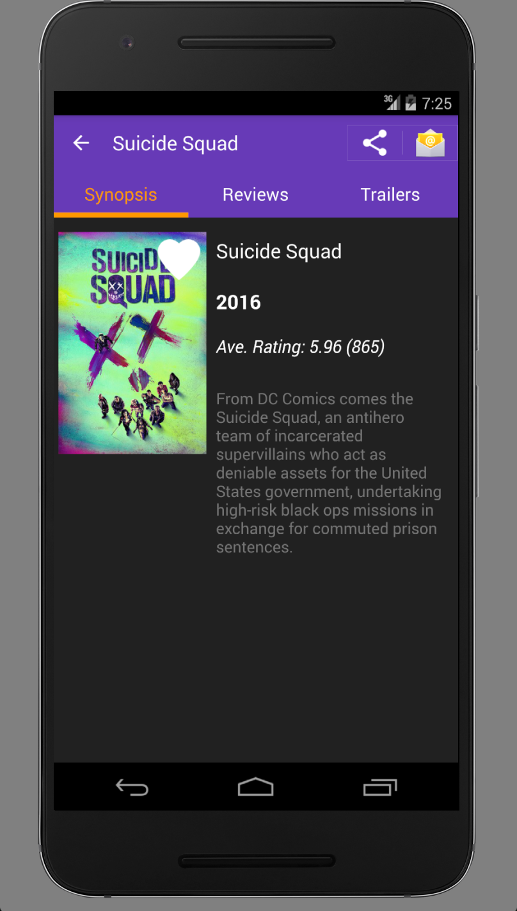
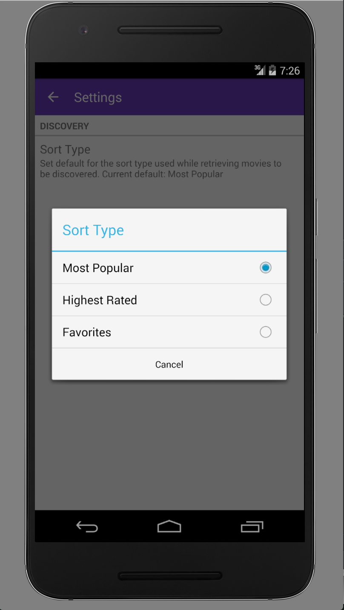

# Nanodegree: Popular Movies
Part of Google's Nanodegree course: A popular movies application. There is a local sqllite database powering a content provider for favoriting a movie. 

# Running The Application
Clone repo and open up the file `res/strings.xml` and replace the value for `moviedb_api_key` with your own api key.

If you do not have an api key, create an account at the [Movedb.org](https://www.themoviedb.org/account/signup). An api key will be generated for you to use.

# Libraries Used
* [Picasso](http://square.github.io/picasso/) for image loading
* [Google Support Library 23+](https://developer.android.com/topic/libraries/support-library/revisions.html) for backward compatible purpose
* [Butterknife](http://jakewharton.github.io/butterknife/) for field and method binding for Android views.

# Screenshots

||||||
:-------------------------:|:-------------------------:|:-------------------------:|:-------------------------:|:-------------------------:|:-------------------------:|:-------------------------:|:-------------------------:|:-------------------------:
